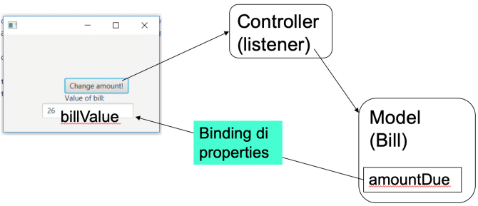

> Ricordarsi di configurare per ogni main il **run configuration**
>
> - Se non è mai stato configurato configurare una nuova applicazione
> - andare nella sezione Build and Run, fare click su modify options(a destra)
> - nella scheda Java fare click su add VM options e inserire questo:
    >     --module-path "C:\\Program Files\\Java\\javafx-sdk-19.0.2.1\\lib" --add-modules javafx.controls,javafx.fxml

* * *

# Appunti

## Uso di java Beans e Properties

Usiamo le properties dei java beans per caratterizzare i dati del model in modo standard.
Impariamo a usare le properties dei JavaBeans, e ad associare Listeners alle properties, per reagire ai cambiamenti di
valore delle properties in modo automatico.

L'obiettivo è evitare di scrivere codice dettagliato per visualizzare nella GUI i valori delle property mentre cambiano,
e/o per inizializzare i valori delle property a partire dai dati acquisiti in input (form) nella GUI

## JavaBeans

I Java Beans sono classi java che rispettano uno standard di definizione dei metodi e delle loro variabili di istanza (o
di stato)

- Per ogni variabile *xxx* di istanza che vogliamo esporre come **property** del javabean, noi dobbiamo definire il
  metodo
  `public Type getXxx()`
  , per leggere valore della property
- Se vogliamo permettere di modificare il valore della property, dobbiamo definire anche il metodo
  `public void setXxx()`
  , per assegnare un valore alla property

### Il concetto di property è slegato dall'esistenza di variabili di istanza nel java bean:

- Il java bean può avere **variabili di istanza private che non sono property** (in quanto prive di
  metodo getXxx()) e servono internamente per le computazioni
- **Il nome di una property è determinato dai metodi getXxx() e setXxx()**, NON dal nome della
  variabile di istanza ad essa associata

### Una property potrebbe derivare dall'esecuzione di un metodo getXxx() del java bean

- Noi possiamo definire metodi getYyy() (e quindi properties) utili per eseguire codice applicativo che utilizza lo
  stato del bean e fa riferimento a più variabili del bean per restituire risultati
- esempio: se un java bean memorizza due valori numerici in variabili di istanza private, noi possiamo definire una
  property "prodotto", basata sulla definizione del metodo getProdotto(), che restituisce il prodotto dei due valori

```java
public class ExampleBean {
    private int var1;
    private int var2;

    public ExampleBean() {

    }

    public void setProp1(int n) {
        this.var1 = n;
    }

    public int getProp1() {
        return var1;
    }

    public void setProp2(int n) {
        this.var2 = n;
    }

    public void getProp2() {
        return var2;
    }

    public void getProdotto() {
        return var1 * var2;
    }
    // NB: prop1,prop2 e prodotto sono properties;
    //     var1 e var2 NON sono property
}
```

Le properties dei java beans servono per facilitare la definizione di **bindings** tra variabili.
I bindings permettono di **cambiare il valore di variabili in dipendenza da altre**:
quando si definisce un binding (dipendenza) tra due variabili, se una cambia valore, l'altra viene modificata di
conseguenza.
I bindings sono utili in varie situazioni. Es:

- Definire una variabile che ha come valore la somma dei valori di altre n variabili, con la somma che si aggiorna
  automaticamente quando una di queste cambia valore
- Nelle interfacce grafiche, legare la componente grafica a un modello, in modo che la componente grafica si aggiorni
  automaticamente ogni volta che il modello cambia valore

<sub>Strettamente legato a Observer Observable e a MVC</sub>

## Properties con JavaFX (vedere javaFXML.a.bindings)

JavaFX offre classi di libreria che rappresentano e gestiscono javabeans e properties.
Es: la `abstract class DoubleProperty` di javadoc rappresenta **una property** di un bean.
La property è di **tipo Double e implementa `ObservableValue<Number>`**
esistono anche le `IntegerProperty` o le `StringProperty`.

`public interface ObservableValue<T>` definisce entità che rachiudono un valore e permettono di osservare i cambiamenti
di tale valore.
i metodi sono:

- `T getValue()`: restituisce il valore dell’oggetto ObservableValue.
- `void addListener(ChangeListener<? super T> listener)` : aggiunge all’ObservableValue un listener di cambiamento
- `void removeListener(ChangeListener<? super T> listener)`: toglie il listener dall’ObservableValue.

Dove **&lt;? super T&gt;** indica che il tipo del ChangeListener deve essere una **superclasse** di T (il contrario di
&lt;? extends T&gt;)
<sub>(qui Observable è javafx.beansObservable, non l’Observable deprecata)</sub>

`public interface ObservableValue<T>` definisce i listener di
cambiamento di valore delle properties di tipo T.
Un ChangeListener viene notificato ogni volta che l’oggetto l’ObservableValue a cui è associato il listener cambia
valore.
Le classi che implementano ChangeListener devono implementare il
metodo `void changed(ObservableValue<? extends T> obs, T oldValue, T newValue)`
Per specificare cosa deve fare il listener quando rivela un evento di cambiamento dell'ObservableValue obs.

## Uso di java beans e BINDING delle properties ai componenti della GUI (vedere JavaFXML.b.properties)

La seguente aplicazione visualizza il valore del "bill" adongi suo cambiamento. Il bill cambia valore quanto l'utente
clicca sul bottone. Come prima, il click assegna al bill un numero intero casuale. Bill rappresenta una fattura.
NB: i TextField hanno una **String Property** che mantiene il loro valore infatti la riga `billValue.textProperty()`
restituisce tale property

```java
//nel model
class Bill {
    // Definiamo la property «amountDue» come StringProperty affinché sia compatibile
    //con la text property del campo della GUI
    private SimpleStringProperty amountDue = new SimpleStringProperty();

    // Definiamo un getter per il valore della property
    public final String getAmountDue() {
        return amountDue.get();
    }

    // Definiamo un setter per il valore della property
    public final void setAmountDue(String value) {
        amountDue.set(value);
    }

    // // Definiamo un getter per la property stessa
    public SimpleStringProperty amountDueProperty() {
        return amountDue;
    }
}
```

```java
//nel Controller
public class PropertiesController {
    private Bill electricBill = new Bill();
    private final Random r = new Random();
    @FXML
    private TextField billValue;
    @FXML
    private Label ris;

    @FXML
    protected void onHelloButtonClick() {
        ris.setText("Value of bill:"); // brutto...
        int i = r.nextInt(10000);
        electricBill.setAmountDue(new StringBuilder().append(i).toString());
    }

    public void bindProperties() {
        // Questa istruzione associa la SimpleStringPropert del textField billValue 
        // (billValue.textProperty())
        // alla SimpleStringProperty amountDueProperty di electricBill
        // Quindi ogni volta che amountDueProperty viene modificata,
        // si aggiorna la visualizzazione di billValue nella GUI.

        // Inoltre il binding tra queste due property
        // evita di definire un listener di cambiamento esplicito (ChangeListener)
        // Quindi semplifica il codice del controller
        billValue.textProperty().bind(electricBill.amountDueProperty());
    }
}
```


Nello start dove c'è il main facciamo partire il `bindProperties()` così non viene chiamato solo al primo click ma viene
chiamato e parte appena parte l'interfaccia

```java
public class PropertiesApp extends Application {
    @Override
    public void start(Stage stage) throws IOException {
        FXMLLoader fxmlLoader = new FXMLLoader(PropertiesApp.class.getResource("propertiesView.fxml"));
        Scene scene = new Scene(fxmlLoader.load(), 320, 240);
        stage.setTitle("Binding with properties");
        stage.setScene(scene);
        // Invoco il metodo bindProperties nel main
        PropertiesController contr = fxmlLoader.getController();
        contr.bindProperties();
        stage.show();
    }
}
```
DAFINIRE
video 46:23